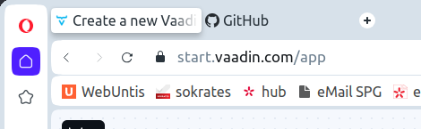
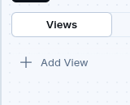
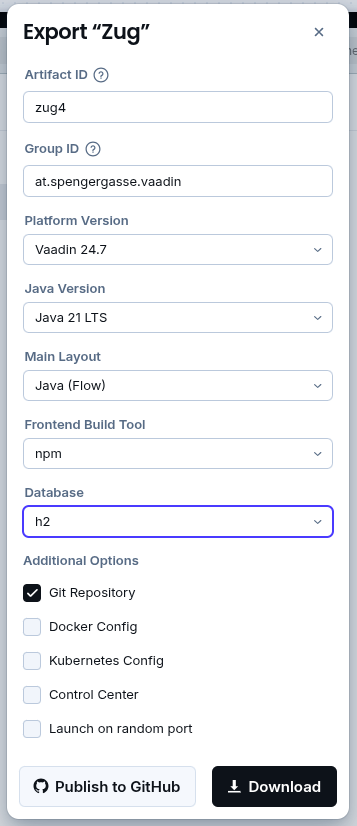
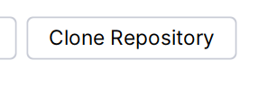
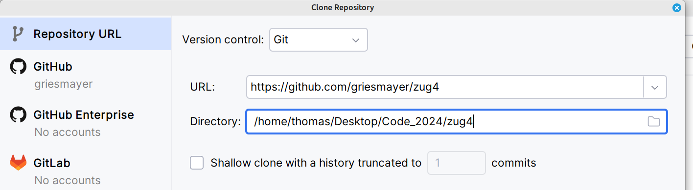
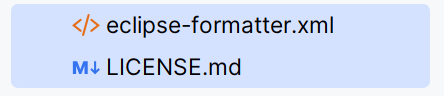
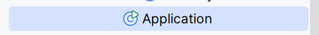
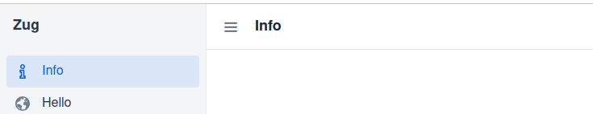

# Projekt anlegen
## vaadin Start Projekt
Öffnen der WebSeite https://start.vaadin.com/
 

 
Definieren der Views
 

* Empty View für die Infos
* Hello World View für copy von Buttons
 
Download des Projekts
  
  
 
  
* Domain angeben
* Projektname
   
Publish to GIT
## IntelliJ Start Projekt
Clone des GitHub Repository
 

 

 
Beide Dateien löschen
 

 
Projekt ausführen
 

 
